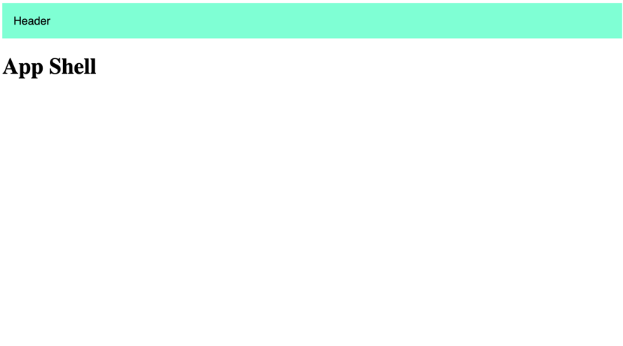

### Module Federation Vanilla JS example
Simplest example on how to do Module Federation with Vanilla JS (without React.js or others).

### Structure
Is a monorepo structure.
The **home** is the app container where it's imported the **header** remote module.

* home
* header


### Getting started
Compatible with `Node.js 14+`.

It'a  monorepo so you can find workspaces setting in package.json.
- `npm i` will install every packages dependencies
- `npm run build` will build each package.
- `npm run start` will serve each package so you can import remote module on home app.

home is served on  http://localhost:4000
header is served on  http://localhost:4001

### Module Federation Settings
**home** `webpack.config.js`
```js
...
new ModuleFederationPlugin({
    name: "home",
    filename: "remoteEntry.js",
    remotes: {
        header: "header@http://localhost:4001/remoteEntry.js"
    },
    shared: {
        ...deps
    }
}),
...
```

**header** `webpack.config.js`
```js
...
new ModuleFederationPlugin({
    name: "header",
    filename: "remoteEntry.js",
    exposes: {
        "./Header": "./src/Header"
    },
    shared: {
        ...deps
    }
}),
...
```

### Explanations
1.  Configure the options of the Module Federation plugin. You can do this by specifying an options object inside the constructor of the plugin.

```js
new ModuleFederationPlugin({
  name: 'my_app',
  filename: 'remoteEntry.js',
  exposes: {
    './Component': './src/app/component.ts'
  },
  shared: ['@angular/core', '@angular/common']
})
```

-   `name`: the unique name of your application, used to identify the modules being shared.
-   `filename`: the name of the file that will be generated by the plugin, containing information about the shared dependencies.
-   `exposes`: an object that defines which modules should be exposed for sharing.
-   `shared`: an array of common dependencies that need to be handled separately to ensure they are used consistently across all applications.

### Result

